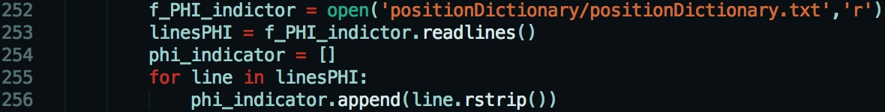

# Project Name and Description
The perfomance analysis for De-identification and Colenda methods on Clinical texts.
This project runs on Mac, if you want to run on windows, please see the User Guide file for each de-identification tools.

## Dictionary Training User Guide
* Environment: python 2.7
* Working Path: Tools/DictionaryTraining
* Usage:
     * Generate training and test dataset ---- 90%/ 80%/ 70%/ 60%/ 50%... of original:
     ```
     (i)  Open generateTrainFiles.py
     ```
     ```
     (ii) Set percentage & output path you want and Run the file
     ```

     * Establish external dictionary from the training dataset:
     ```
     (i) Open dictionaryTraining.py
     ```
     ```
     (ii) Set the output path for the dictionary and Run the file
     ```

## Tools User Guide
#### 1. HMS Scrubber
   * Environment: Java 1.8
   * Working Path: Tools/HMS-Scrubber/scrubber-core-2.8
   * Deidentification principle: Pattern Matching
   * Usage      
        * Add Dictionary to the Scruuber's Configuration File:
        ```
        (i) Add dictionaries to the scrubber configuration file, which is under the 'conf' folder.
            E.g. conf/ScrubberConfiguration.xml
        ```      
        ```diff
        + Note: dictionary files should put under the 'conf' folder
        ```
        
        * Scrub on the Test Dataset:
        ```
        (i) Run 'sh scrubber.sh <input_file> <config_file>'
             E.g. sh scrubber.sh test.xml conf/ScrubberConfiguration.xml
        ```
        ```
        (ii) System will create a new folder under the root folder
              The scrubbed text is in under 'success' folder.
        ```
        ```diff
        + Note: test dataset should reformat first. (Add header and tailer)
        + Modify ScrubbedConfiguration file when you want to change the using dictionaries in the scrubber.
        ```
        
        * Analyse on the Scrubbed Text:
        ```
        (i) Open performanceAnalysis/hms_analysis.py file
        ```
        ```
        (ii) Setup the input file path and output Result folder path, then Run the file.
             It will show 
                           the total number of scrubbed, 
                           the number of True Positive, 
                           the number of False Positive
                                                          for People and Position category
        ```
        ```diff
        + If you want to calculate the Recall, you need to mannualy calculate the total number of PHI in the scrubbed text.
        + I use Sublime Text3 and use command+F to find the PHIs that I interested. 
        + It will show you the total number in the left corner.
        ```
       
#### 2. DE-ID
   * Environment: perl
   * Working Path: Tools/DEID/deid-1.1
   * Deidentification principle: Pattern Matching
   * Usage:       
        * Add Dictionary to the Configuration File and Remove Annotation in the Processing File:
        ```
        (i) Add dictionaries under the 'lists' folder
            E.g. lists/peopleDictionary/peopleDictionary90.txt
        ```   
        ```
        (ii) Remove annotation in 'deid.pl' in line 187-188, 722 and 747.
            (This step only needs to do when you want to use the training dictionary.)
        ```
        
        ```diff
        + Note: The original DE-ID has been expanded three more functions.
        - 1) Imported HMS Name Dictionary Function:
          The imported dictionary is stored as 'doctor_names.txt'.
          If you want to start this function, pls remove the annotation in line 191 and 725.
        
        - 2) Regx Matching Function:
          Becuase Regx is not a real dictionary, the program will first using regx to match names.
          Then store the matched names into 'doctor_names_regx.txt' automatically.
          If you want to start this function, pls remove the annotation in line 192, 726 and 698.
        
        - 3) Only Use the Training People Dictionary and Position Dictionary Funtion:
        
        + 3.1)If you want to try "only use the training People dictionary"
          Modify the orginal deid.config file 
            Name filter = y
            Doctor names = y
            and all other filters and names = n
          
          Add annotation in line 705-713, 717-718 and 1277-1285.
          
        + 3.2)If you want to try "only use the training Position dictionary"
          Modify the original deid.config file
            Location filter = y
            Hospital names = y
            and all other filters and names = n
            
          Add annotation in line 732-740, 744, 749-765 and 1255-1259. 
        ```
        
        * Scrub on the test dataset:
        ```
        (i) Run 'perl deid.pl <input_filename> <config_filename>'
             E.g. perl deid.pl inputFile deid.config
        ```
        ```diff
        + Note: filrname should without extension, where extension must be .text            
        ```
        
        ```
        (ii) System will create a new file under the running path --- filename.res,
              which is the scrubbed text.
        ```
        
        * Analyse on the scubbed text:
        ```
        (i) Open performanceAnalysis/deid_analysis.py
        ```
        ```
        (ii) Setup the input file path and output Result folder path, then Run the file.
             It will show 
                           the total number of scrubbed, 
                           the number of True Positive, 
                           the number of False Positive
                                                          for People and Position category
        ```

#### 3. PHI-Reducer
   * Environment: python 3.3
   * Working Path: Tools/PHI-Reducer/phi-reducer-0.4.5/phireducer
   * Deidentification principle: Pattern Matching
   * Usage:       
        * Add dictionary to the Configuration File:
        ```
        (i) Add the dictionary file path to the running file phi_reducer.py line 252,
            as showed in the following image 
        ```
        
        
        
        * Scrub on the test dataset:
        ```
        (i) Run python3 phi_reducer.py
        ```
        ```diff
        + Note: Need to create two folders <input_test> and <output_test>. 
        +       Put all of the text you want to scrub into the <input_test> folder         
        ```
        
        ```
        (ii) System will generate all of the corresponding scrubbed texts into the <output_test> folder.
        ```
        
        * Analyse on the scubbed text:
        ```
        (i) Open performanceAnalysis/phi_reducer_analysis.py
        ```
        ```
        (ii) Setup the input file path and output Result folder path, then Run the file.
             It will show 
                           the total number of scrubbed, 
                           the number of True Positive, 
                           the number of False Positive
                                                          for People and Position category
        ```


#### 4. MIST
   * Environment: python 2.7
   * Working Path: Tools/MIST/MIST_2_0_4/src
   * Deidentification principle: Machine Learning 
   * Usage:       
        * Install MIST on MAC:
        ```
        (i) Set global variable:
            export MAT_PKG_HOME = /path/to/MAT/folder
        ```
        ```
        (ii) Run install file:
             cd <toolkit_dir>
             ./install.sh  
        ```
        ```diff
        + Note: It will ask you to provide Terminal.app path when running,
        +       if you just press 'Enter' and don't give a direct path, it can't work correctly.
        +       Path for Terminal.app on Mac is /Applications/Utilities
        ```
       
        * Learn dictionary automatically:
        ```
        (i) Preprocess the original i2b2 data --- Split large file by ID
            python tasks/AMIA/utils/split_AMIA_file.py --extend_dates /
            --promote_type_attr train.xml outdir
        ```
        ```
        (ii) Preprocess the original i2b2 data --- Build model
             $MAT_PKG_HOME/bin/MATEngine --task "AMIA Deidentification" /
             --input_dir outdir --input_file_re ".*[.]xml" --input_file_type xml-inline /
             --workflow "Process tagged untokenized docs" --steps "zone and align" /
             --output_dir json-outdir --output_file_type mat-json --output_fsuff ".json"
        ```
        
       ```diff
       + Note: --input_file_type should be set as 'xml-inline' and can't be raw for i2b2 data
       ```
        
       * Scrub on the test dataset:
       ```
       (i) Train and model as the default model
           $MAT_PKG_HOME/bin/MATModelBuilder --task "AMIA Deidentification" --save_as_default_model /
           --nthreads=20 --max_iterations=15 --input_files "json-outdir90/*.json"
       ```
       ```
       (ii) Run the training model on one file
            $MAT_PKG_HOME/bin/MATEngine --task "AMIA Deidentification" --workflow Demo /
            --input_file <input_file> --input_file_type raw --output_file <output_file> /
            --output_file_type raw --tagger_local --steps "zone,tag,nominate,transform" /
            --replacer "clear -> [ ]"
       ```
        
       * Analyse on the scubbed text:
       ```
       (i) Open performanceAnalysis/mist_analysis.py
       ```
       ```
       (ii) Setup the input file path and output Result folder path, then Run the file.
             It will show 
                           the total number of scrubbed, 
                           the number of True Positive, 
                           the number of False Positive
                                                          for People and Position category
       ```
       ```diff
       + Note: I have combined [Patient] with [Doctor] as People and [Location] with [Hospital] as Position
       ```
#### 5. MetaMap
   * Environment: Java
   * Working Path: Tools/MetaMap/public_mm
   * Usage:       
        * Reformat original text:
        ```
        (i) Run originalReformat.py 
        ```
       
        * Generate potential PHI lists based on the reformatted text:
        ```
        (i) Run generateProtectedWordList.py
            It will generate 3 files --- Hospital, Location and Date potential PHI lists.
        ```
        
        * Remove all of the words that are not in the potential PHI list:
        ```
        (i) 
        ```
        ```
        (ii)
        ```
        
## Articles:
- [Automatic de-identification of textual documents in the electronic health record: a review of recent research](https://github.com/OliviaAo/graduate-Ao/tree/master/Documents/References/1.pdf)
- [BoB, a best-of-breed automated text de-identification system for VHA clinical documents'](https://github.com/OliviaAo/graduate-Ao/tree/master/Documents/References/2.pdf)

## Author
* **Ao Li** 

## Acknowledgements
* **Karin Verspoor** - *Supervisor*
* **Shuangshuang Wang** - *Initial work*


